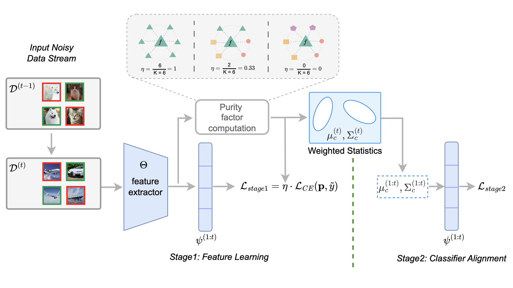

<div align="center">
  
  <div>
  <h1>GeNGuide: Generalized Neighbour Guidance Framework for Noisy Class Incremental Learning</h1>
  </div>

  <div>
      Avnish Kumar&emsp; Jayateja Kalla&emsp; Soma Biswas
  </div>
  <br/>

</div>


Official implementation for IEEE 2025 Paper "GeNGuide: Generalized Neighbour Guidance Framework for Noisy Class Incremental Learning"

<div align='center'>  
    <em>Illustration of the proposed GeNGuide framework for noisy class-incremental learning.</em>  
</div>  


This work addresses the challenging, real-world
problem of Noisy-label Class Incremental Learning, where label
noise adversely affects the performance at each incremental task.
Towards this goal, we propose a two-stage approach leveraging
pre-trained models effectively and information from neighbour-
ing samples. In the first stage, we introduce a neighbour-
guidance cross-entropy loss function for feature learning, where
the contributions of each data sample is computed based on
the labels of neighbouring samples in the feature space, which
also evolves as training progresses. This adaptive loss prioritizes
reliable samples and mitigates the influence of noisy ones. In
the second stage, classifiers are refined using weighted class
statistics, which is also guided by the neighbourhood information.
This step further enhances the model’s performance by aligning
classifiers with the learned class distributions. The proposed
GeNGuide (Generalized Neighbour Guidance) framework works
seamlessly without any modifications for several scenarios of
class-incremental learning, namely (i) when the class-labels have
varying amount of noise, including the noise-less case; (ii) when,
in addition to the presence of noisy labels, the data is imbalanced,
which makes the problem even more challenging. To the best
of our knowledge, this is the first work which takes a step
towards building generalized models which achieves state-of-
the-art performance on several challenging class-incremental
learning protocols, thereby justifying its effectiveness.

Contact: <kumaravnish.456@gmail.com>


## Installation

This repository is tested in an Anaconda environment. To reproduce the results, create your environment as follows:

1. Clone the repository:
```
git clone https://github.com/avnCode/GeNGuide.git
cd GeNGuide
```

2. Create conda environment
```
conda create -y -n GeNGuide python=3.10
conda activate GeNGuide
```

3. Install dependencies
```
conda install pytorch==1.12.1 torchvision==0.13.1 torchaudio==0.12.1 cudatoolkit=11.3 -c pytorch
pip install tqdm==4.66.4
pip install timm==0.5.4
pip install numpy==1.24.3
pip install scipy==1.11.1
pip install quadprog==0.1.11
pip install POT==0.9.1
pip install scikit-learn==1.3.2
pip install PyYAML
```

## Usage Instructions    
  
### Command Line Arguments    
  
- `--config`: Specify the path to the configuration file.  
- `--pretrained`: Choose the pre-trained model to be used. The current options available are 'imagenet' or 'moco'.  
- `--noise_type`: Define the type of noise to be applied.   
  
    - For 'cifar10' dataset, you can use 'symmetric' or 'asymmetric'.  
    - For 'cifar100' dataset, 'random' or 'superclass' can be used.  
  
  
### Training Example  
  
```bash  
python main.py --config=exps/genguide_cifar.json --noise=0.4 --noise_type='random' --dataset='cifar100' --pretrained='imagenet'  
```


## Pre-trained Models
Please download pre-trained ViT-Base models from [MoCo v3](https://drive.google.com/file/d/1bshDu4jEKztZZvwpTVXSAuCsDoXwCkfy/view?usp=share_link) and [ImaegNet-21K](https://drive.google.com/file/d/1PcAOf0tJYs1FVDpj-7lrkSuwXTJXVmuk/view?usp=share_link) and then put or link the pre-trained models to ```GeNGuide/pretrained```